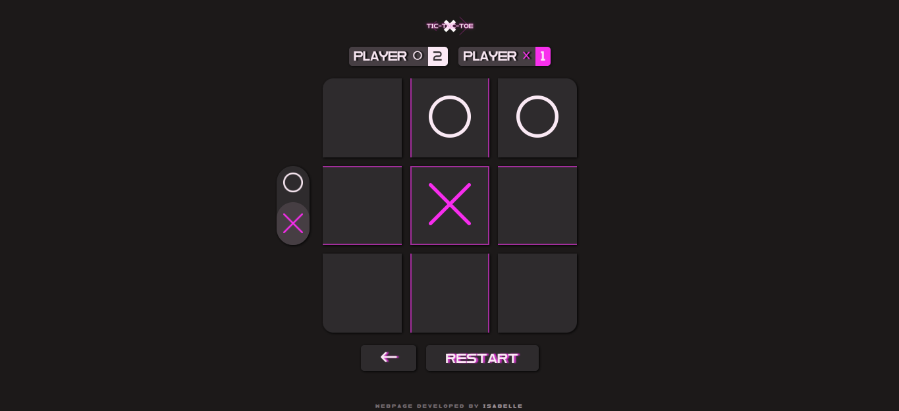

# Tic-Tac-Toe

## [SITE HERE](https://isabdch.github.io/tic-tac-toe/)

## 📖 Table of Contents

- [Project Description](#project-description)
- [Status](#status)

 

## ✏️ Project Description

Tic-tac-toe game made with pure Javascript. The game has the option to choose which player will start playing and show whose turn is at the moment, all in the same place. Beyond that, there is the score which is saved even if you close the page. To clear the score, you just need to click above it.

Project is created with:

- ### HTML

- ### CSS

- ### JavaScript

 

## ⏱️ Status

This project is finished. 

---

Made with 💜 by Isabelle Brandão 👋 [See my LinkedIn](https://www.linkedin.com/in/isabelle-brand%C3%A3o-5645551a8/)
